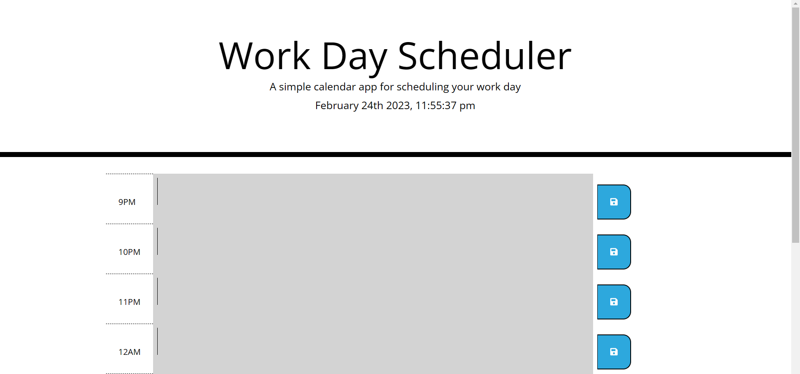

# Work Day Scheduler

## Description

This a workday scheduler which was made using jQuery and Bootstrap. It stores events which are inputed by the user and displays the current date and time and uses a color coded system to differentiate between Past, present and future events

https://shukri74.github.io/work-day-planner/

## Installation

N/A

## License

MIT license

## Badges

 

 
